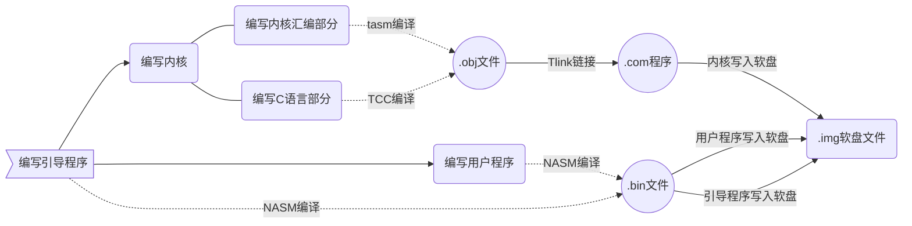

# 实验三：C与汇编开发独立批处理的内核

## 18340052		何泽

[TOC]

## 一、实验目的

> 1、加深理解操作系统内核概念
>
> 2、了解操作系统开发方法
>
> 3、掌握汇编语言与高级语言混合编程的方法
>
> 4、掌握独立内核的设计与加载方法
>
> 5、加强磁盘空间管理工作

## 二、实验要求

> 1、知道独立内核设计的需求
>
> 2、掌握一种x86汇编语言与一种C高级语言混合编程的规定和要求
>
> 3、设计一个程序，以汇编程序为主入口模块，调用一个C语言编写的函数处理汇编模块定义的数据，然后再由汇编模块完成屏幕输出数据，将程序生成COM格式程序，在DOS或虚拟环境运行。
>
> 4、汇编语言与高级语言混合编程的方法，重写和扩展实验二的的监控程序，从引导程序分离独立，生成一个COM格式程序的独立内核。
>
> 5、再设计新的引导程序，实现独立内核的加载引导，确保内核功能不比实验二的监控程序弱，展示原有功能或加强功能可以工作。
>
> 6、编写实验报告，描述实验工作的过程和必要的细节，如截屏或录屏，以证实实验工作的真实性

## 三、 实验内容

> (1) 寻找或认识一套匹配的汇编与c编译器组合。利用c编译器，将一个样板C程序进行编译，获得符号列表文档，分析全局变量、局部变量、变量初始化、函数调用、参数传递情况，确定一种匹配的汇编语言工具，在实验报告中描述这些工作。
>
> (2)写一个汇编程和c程序混合编程实例，展示你所用的这套组合环境的使用。汇编模块中定义一个字符串，调用C语言的函数，统计其中某个字符出现的次数（函数返回），汇编模块显示统计结果。执行程序可以在DOS中运行。
>
> (3) 重写实验二程序，实验二的的监控程序从引导程序分离独立，生成一个COM格式程序的独立内核，在1.44MB软盘映像中，保存到特定的几个扇区。利用汇编程和c程序混合编程监控程序命令保留原有程序功能，如可以按操作选择，执行一个或几个用户程序、加载用户程序和返回监控程序；执行完一个用户程序后，可以执行下一个。
>
> (4) 利用汇编程和c程序混合编程的优势，多用c语言扩展监控程序命令处理能力。
>
> (5) 重写引导程序，加载COM格式程序的独立内核。
>
> (6)拓展自己的软件项目管理目录，管理实验项目相关文档

## 四、实验方案

### 1. 相关基础原理

- 操作系统内核工作流程

  ```mermaid
    graph LR
    A>引导程序]--引导-->B(操作系统内核)--组成1---C((汇编))--调用-->D{用户程序}
    B(操作系统内核)--组成2---F((C程序))
    C-.混合编译.-F
    F--调用-->D
  ```

- 汇编和C相互调用（`tasm`+`tcc`语法）

  - 汇编调用C函数变量

    - 在C中声明为全局变量

    - 在汇编程序头部添加`extrn`+下划线+变量名

  - C函数调用汇编函数

    - 汇编函数编写时函数名前加下划线

    - 在程序头部添加`extern`+返回类型+函数名

### 2.实验环境与工具版本

  - 平台：`Windows + Ubuntu`

    

  - c语言编译器：`tcc`,运行环境：`DosBox 0.74`

  - 汇编工具：`nasm`+`tasm`

    

- `CMake`：

  

  - 虚拟机：`VMware Workstation 15`

### 3. 实验流程与思路

根据上面操作系统内核的运行流程，我 编写的流程如下：



**注：可以看出，我混用了TASM和NASM，这个的原因我会在“八、实验总结”中解释**

## 五、实验过程与结果

  ==***（这一部分只写最终结果。完成过程中遇到的问题、错误以及一步步检查问题并不断改进的过程将在下一板块 “七、问题及解决方案” 中详细叙述）***==

### 1. 操作系统功能

- 操作系统内核功能

  | 输入命令 |                      功能描述与参数解释                      |
  | :------: | :----------------------------------------------------------: |
  |   name   |                        显示程序的名字                        |
  |   size   |                     显示程序的名字与大小                     |
  |  clean   |                    清屏，只留下开头的指引                    |
  |   time   |                        获取当前的时间                        |
  |  author  |                         显示姓名学号                         |
  |   cal    | 计算某个字母在某个单词的出现次数，命令格式举例：`cal a apple`代表计算a在apple中出现多少次 |
  |  lower   |    将输入字符全部转换为小写，命令格式举例：`lower ABcdE`     |
  |  upper   |    将输入字符全部转换为大写，命令格式举例：`upper ABcdE`     |

- 执行用户程序

  用户程序功能为数字在屏幕反弹，第几个程序就是数字几在反弹

  |    输入命令    |                             解释                             |
  | :------------: | :----------------------------------------------------------: |
  | run + 程序序号 | 可以执行单个程序，如`run 1`，也可以按顺序执行多个，如`run 2341` |

- 批处理命令

  | 输入命令 |                 功能                 |
  | :------: | :----------------------------------: |
  |  a.cmd   |        按顺序执行1-4用户程序         |
  |  b.cmd   |   执行完1-4用户程序后获取当前时间    |
  |  c.cmd   | 显示用户文件的名字、大小和所在扇区号 |

### 2. 引导程序

- 引导程序的作用是加载操作系统内核，同时输出字符，因为和之前的一样，不再详细叙述
- 因为引导成功后直接进入内核，而内核会先清屏后输出字符，所以在实际过程中引导程序的字符并不会被看见，因为太快了，只有在程序出错导致无法正确引导的时候才能看见这串字符

### 3. 内核：汇编部分

**这一部分主要就是C中要调用的几个函数，主要是BIOS调用，比如字符的输入输出，获取时间，还有加载用户程序**

- 首先声明要用到的C程序中的变量  

- 清屏

  ```assembly
  public _clean
  _clean proc
  	mov ax,0003H
  	int	10h
  	ret
  _clean endp
  ```

- 然后是C要大量调用的字符输出函数

  ```assembly
  public _printchar
  _printChar proc
  	push bp
  	mov bp,sp
  	mov al,[bp+4]
  	mov bl,0
  	mov ah,0eh
  	int 10h
  	mov sp,bp
  	pop bp
  	ret
  _printchar endp
  ```

- 字符读入

  ```assembly
  public _getchar
  _getchar proc
  	mov ah,0
  	int 16h
  	mov byte ptr[_in],al
  	ret
  _getchar endp
  ```

- 获取当前系统时间

  ```assembly
  public _gettime
  _gettime proc
      push ax
      push bx
      push cx
      push dx
  
      mov ah,2h
      int 1ah
  	mov byte ptr[_hour], ch
  	mov byte ptr[_min], cl
  	mov byte ptr[_sec], dh
  
  	pop dx
  	pop cx
  	pop bx
  	pop ax
  	ret
  _gettime endp
  ```
  
- 加载、运行用户程序

  ```assembly
  public _run
  _run proc
      push ax
      push bx
      push cx
      push dx
      push es
      mov ax, 1000h
      mov es, ax
      mov bx, 1400h           ;ES:BX=读入数据到内存中的存储地址
      mov ah, 2 		        ;功能号
      mov al, 1 	            ;要读入的扇区数1
      mov dl, 0               ;软盘驱动器号0
      mov dh, 0 		        ;磁头号0
      mov ch, 0               ;柱面号0
      mov cl, byte ptr[_num]  ;起始扇区号
      int 13H 		        ;调用13H号中断
      mov bx, 1400h           ;将偏移量放到 bx
      call 1000h:bx           ;跳转到该内存地址
      pop es
      pop dx
      pop cx
      pop bx
      pop ax
      ret
   _run endp
  ```

### 4. 内核：C程序部分

- 首先用`extern`关键字声明需要调用的汇编函数，并将要用到的变量声明为全局变量

- 对于用户程序的名字、大小、扇区号我是用一个结构体存储，后面会打印存储的信息

  ```c
  typedef struct{
  	char name[20];
  	char size[20];
  	char index[5];
  }usrprog;
  
  usrprog t[5]={
  	{"user_program1","2419Bytes ","11"},
  	{"user_program2","2421Bytes ","12"},
  	{"user_program3","2421Bytes ","13"},
  	{"user_program4","2423Bytes ","14"},
  	{"myos.asm     ","2384Bytes ","2-10"}
  };
  ```

==下面这些是基础函数，供后面的各种功能调用==

- 打印字符函数，对于字符串的每一位都调用汇编的`printchar`函数

  ```c
  void print(char *str)
  {
  	while(*str != '\0'){
  		printchar(*str);
  		str++;
  	}
  }
  ```

- 在DOS中获取用户输入的命令

  ```c
  int getline(char str[],int len)
  {
  	if(!len)
  		return 0;
  	i=0;
  	getchar();
  	while(in!='\n'&&in!='\r') {
  		int m=in;
  		if(m==8){
  			i--;
  			getchar();
  			continue;
  		}
  		printchar(in);
  		str[i++]=in;
  		if(i==len){
  			str[i]='\0';
  			printchar('\n');
  			return 0;
  		}
  		getchar();
  	}
  	str[i]='\0';
  	print("\n\r");
      return 1;
  }
  ```

- 比较两个字符串是否相等，主要用于命令行命令、参数的解析

  ```c
  int strcmp(char* str1,char* str2)
  {
  	while(*str1!='\0' && *str2!='\0'){
  		if(*str1!=*str2) 
  			return 0;
  		str1++;
  		str2++;
  	}
  	if(*str1=='\0' && *str2=='\0') 
  		return 1;
  	return 0;
  }
  ```

- 将一个字符串复制到另一个

  ```c
  void strcpy(char src[],char p[])
  {
  	i=0;
  	while(src[i]!='\0'){
  		p[i]=src[i];
  		i++;
  	}
  	p[i]='\0';
  }
  ```

- 计算字符串长度

  ```c
  int strlen(char str[])
  {
  	i=0;
  	while(str[i]!='\0')
  		i++;
  	return i;
  }
  ```

- 这个函数调用的次数也很多，取一个字符串从某一位开始特定长度的字符，主要用于解析命令行参数（用这个把命令去掉只剩参数）以及多参数命令

  ```c
  int substr(char src[],char m[],int begin,int len)
  {
  	for(i=begin; i<begin+len; i++)
  		m[i-begin] = src[i];
  	[begin+len]='\0';
      return 1;
  }
  ```

- 上面写了输出字符串，下面这个输出打印一个整数

  ```c
  void printint(int n)
  {
  	i=0;
  	while(n){
  		tmp=n%10;
  		output[i++]='0'+tmp;
  		n/=10;
  	}
  	for(j=0; j<i; j++)
  		buf[j]=output[i-j-1];
  	for(j=0; j<i; j++)
  		output[j]=buf[j];	
  	output[i]='\0';
  	print(output);
  }
  ```

==以上的基本函数已经完成，下面是各种功能==

- 计算某个字母在一个单词出现的次数，需要注意的是，主函数已经将命令去掉，传入的只是“要统计的字母+空格+单词”这一个字符串

  ```c
  void cal(char str[])
  {
      i=2,tmp=0;
      while(str[i]) {
          if(str[i]==str[0])
              tmp++;
          i++;
      }
      print("\r");
      printint(tmp);
      print("\r\n\n");
  }
  ```

- 大小写转换函数，判断字符串每一位并转换，然后调用前面的`print`函数输出结果

  ```c
  void upper(char str[])
  {
     	i=0;
     	while(str[i]) {
       	if(str[i]>='a' && str[i]<='z')  
        		str[i]=str[i]+'A'-'a';
  	  	i++;
      }
      print("\r");
      print(str);
      print("\r\n\n");
  }
  
  void lower(char str[])
  {
     	i=0;
     	while(str[i]) {
       	if(str[i]>='A' && str[i]<='Z')  
        		str[i]=str[i]-'A'+'a';
  	  	i++;
      }
      print("\r");
      print(str);	
      print("\r\n\n");
  }
  ```

- 调用汇编函数取得时间后，因为是16进制，需要转换为10进制，处理后并按一定格式打印输出

  ```c
  void time()
  {
  	gettime();
  	tmp=hour/16*10+hour%16;
      print("Now, the time is ");
      if(tmp==0)
  		print("00");
  	else if(tmp>0 && tmp<10) 
  		printchar('0');
  	printint(tmp);
  	printchar(':');
  	tmp=min/16*10+min%16;
  	if(tmp==0) 
  		print("00");
  	else if(tmp>0 && tmp<10) 
  		printchar('0');
  	printint(tmp);
  	printchar(':');
  	tmp=sec/16*10+sec%16;
  	if(tmp==0) 
  		print("00");
  	else if(tmp>0 && tmp<10) 
  		printchar('0');
  	printint(tmp);
  	print("\r\n\n");
  }
  ```

- 用户选择执行哪个用户程序

  ```c
  void ChooseToRun()
  {
  	for(j=4; j<strlen(input); j++){
  		if(input[j]<'1' || input[j]>'4'){
  			print("This program is not exist! The program 1-4 is available.\n\n");
  			return;
  		}
  	}
  	for(j = 4; j<strlen(input); j++){
  		if(input[j]==' ') 
  			continue;
  		else if(input[j]>='1' && input[j]<='4'){
  			num=input[j]-'0'+10;
  			run();
  		}
  	}
  }
  ```

- 主函数

  **就是调用上面的函数，根据不同的命令调用不同的函数，批处理命令就是按照顺序调用多个函数；因为全是if-else，就不在实验报告中解释了，源码为`myos.c`程序中的`void myos();`函数**

### 5. 用户程序

用户程序和上次的一样，只不过上次是按下`ESC`键后退回到操作系统，这次在这个基础上增加了碰撞10次后就返回操作系统，其余部分一模一样，不再叙述。

### 6. 编译

- 首先在`DosBox`中使用`TCC`、`TASM`以及`TLINK`编译内核，并生成`.com`程序

  - 启动`DosBox`，将目录挂载到`DosBox`的D盘并进入

    

  - 使用`TCC`

    

  - 使用`TASM`

    

  - 使用`TLINK`链接

    

- 剩下的汇编我使用`NASM`编译，并在`Ubuntu`下使用`dd`命令写入软盘

  **但是这个时候我想，每次写完代码后如果我想运行，在`DosBox`中链接后，在`Ubuntu`我需要输入5个`nasm`命令（一个引导程序+4个用户程序），然后再输入6个`dd`命令将这些写入软盘，这实在是太麻烦了！！！**

  **所以我就想，有没有什么办法可以让这些工作自动化，一步完成呢？后来我想到了：`CMake`！！！**

  **只要写好`Makefile`，输入`make`指令就可以自动完成这些所有工作了~下面是我的`MakeFile`**

  ```makefile
  BIN = boot.bin prog1.bin prog2.bin prog3.bin prog4.bin
  IMG = heze.img
  all: clear $(BIN) $(IMG)
  clear:
  	rm -f $(BIN) $(IMG)
  %.bin: %.asm
  	nasm -fbin $< -o $@
  %.img:
  	/sbin/mkfs.msdos -C $@ 1440
  	dd if=boot.bin of=$@ conv=notrunc
  	dd if=MYOS.COM of=$@ seek=1 conv=notrunc
  	dd if=prog1.bin of=$@ seek=10 conv=notrunc
  	dd if=prog2.bin of=$@ seek=11 conv=notrunc
  	dd if=prog3.bin of=$@ seek=12 conv=notrunc
  	dd if=prog4.bin of=$@ seek=13 conv=notrunc
  clean:
  	rm *.bin
  ```

  其中，先将以前生成的文件都删除，然后1.44MB软盘是用`/sbin/mkfs.msdos -C $@ 1440`这一句完成创建的，`nasm`命令将所有`.asm`文件汇编为`.bin`文件，然后将所有程序都写入软盘。

  编译：

  

  可见所有的命令都自动执行了。

  **说实话，能自动完成这些命令可以大大提高我的效率，省去了很多时间，内心也很满足~**

### 7. 运行

编译完放到虚拟机运行~

- 开始界面

  

- 输出文件名和大小

  

- 显示时间

  

- 显示作者

  

- 计算字母在单词出现次数

  

- 大小写转换

  

- 运行用户程序1

  

- 批处理命令`c.cmd`

  

**其余的演示无法用截图展示，详见演示视频**

### 8.关于符号列表文档

正常是使用`nm`命令查看，但是我发现`nm`支持查看的文件类型如下：


也就是说`gcc`编译的可以查看但是`tcc`编译的并不支持，所以就没办法查看了。

## 六、创新工作

1. 在老师的要求上添加了以下功能
   - 显示作者、文件大小等信息
   - 获取当前时间
   - 批处理命令
   - 转化大小写
   - 老师的要求是统计单词中特定字符的出现次数，我更进一步，统计哪个字母由用户输入，并非特定
2. 使用`CMake`，各种命令自动执行

## 七、问题及解决方案

- 首先是环境问题，在下一段“实验总结”中叙述
- 起初运行时会出现乱码，原因是没设置段寄存器`ds`的值，也就是没加老师在群里发的那两段代码
- 另外按照原来的写法，段间的跳转也要改，将`cs`和`ip`压栈再`retf`
- 因为以前写的都是`nasm`，改为`tasm`后发现用老师给的`8086`模板后不能用`gs`，会说`“Undefined symbol"`，只能改用`es`，而且原来的`[es:ax]`也要改为`es:[ax]`

​        这次实验的小问题非常之多，但总结起来还是语法的问题，主要是引导程序和用户程序是`nasm`而内核是`tasm`，这样会有很多语法上的不同之处，因为`tasm`很复杂好多命令都不支持导致写法也不同，在网上也查了很多资料，但好在掌握了`tasm`之后便没有太多的问题了；然后再到操作系统内核的编写上，除去语法问题，在功能上的问题倒不是太多，主要是因为大部分功能由`C`编写，我对`C`还是很熟悉而且有一定的熟练程度，所以不会出什么大问题，而内核汇编部分也只是几个`BIOS`调用，所以问题基本上都是汇编语法和写法的问题。

## 八、实验总结

​		这次实验真的是好难。

​		首先是环境的问题，老师给的是`TASM`+`TCC`组合的代码，示例也都是这个组合，我之前觉得这个太老了，不想用这个组合，所以在实验一、二都是用的`NASM`+`GCC`的组合，这个实验最开始当然也不例外，尝试着重写老师给的代码，但后来我发现这是个非常困难的事情，在汇编编译、`c`编译、`ld`链接会出现各种各样奇奇怪怪的问题，比如：链接器`ld`的版本问题，虽然名字一样，但不同来源的程序执行效果是不一样的，有的会报错而有的不会；比如最开始C函数不会被调用，发现是没有转为16位的；后来在群里发现大家也都有各种各样的问题，自己写的也会报一些不知道该怎么解决的错误，所以我还是向现实低了头，改为用 `TASM`+`TCC`编写。

​		此外因为引导程序和用户程序之前都是`nasm`写的，所以便采用了`nasm`和`tasm`混合的方式，虽然用了两套工具，但最后都可以生成`.com`文件，也是可行的。

​		在确定了用`tasm`写之后，其实转变的难度还是有一些的，主要是`tasm`好复杂好麻烦，我也问了几个同学也查了很多资料才大概明白了要注意的事情。

​		总结起来，其实内核的理论知识并不是很复杂，实现的方式排除掉语法问题其实只要懂了原理并不难，可最难的地方应该就是关于环境和语法。这次实验之后我更加觉得要细心，因为一个寄存器的值忘记管了都会导致最后出错；此外，我觉得之后的实验应该先把语法这些弄明白了再去写，如果像这次一样懵懵懂懂得去写然后看哪里出错再去一个一个地改其实也挺浪费时间的。另外，这次实验还有一个点就是我的系统输入命令的时候我忘记读退格键了，也就是说一旦输入错误不能改，只能按回车后重新输入，这个小遗憾下次试验会补上。