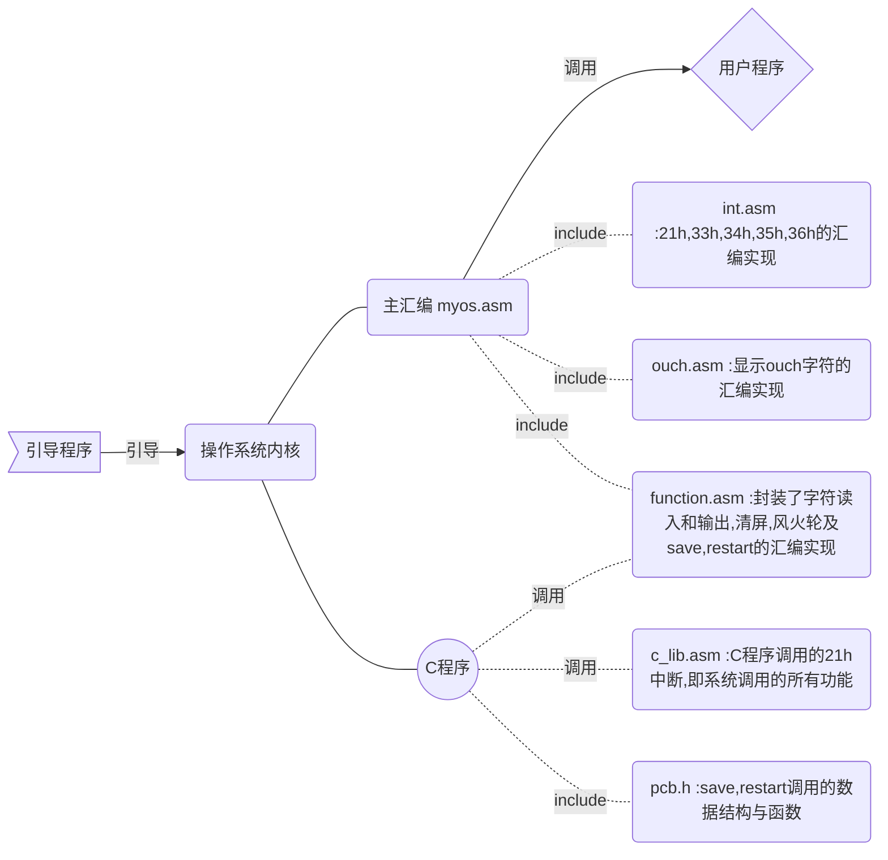

# 实验5    实现系统调用 

## 18340052    何泽 

[TOC]

## 一、实验目的

> 1、学习掌握PC系统的软中断指令
>
> 2、掌握操作系统内核对用户提供服务的系统调用程序设计方法
>
> 3、掌握C语言的库设计方法
>
> 4、掌握用户程序请求系统服务的方法

## 二、实验要求

> 1、了解PC系统的软中断指令的原理
>
> 2、掌握x86汇编语言软中断的响应处理编程方法
>
> 3、扩展实验四的的内核程序，增加输入输出服务的系统调用。
>
> 4、C语言的库设计，实现putch()、getch()、printf()、scanf()等基本输入输出库过程。
>
> 5、编写实验报告，描述实验工作的过程和必要的细节，如截屏或录屏，以证实实验工作的真实性

## 三、实验内容

> 1. 修改实验4的内核代码，先编写save()和restart()两个汇编过程，分别用于中断处理的现场保护和现场恢复，内核定义一个保护现场的数据结构，以后，处理程序的开头都调用save()保存中断现场，处理完后都用restart()恢复中断现场
> 2. 内核增加int 20h、int 21h和int 22h软中断的处理程序，其中，int 20h用于用户程序结束是返回内核准备接受命令的状态；int 21h用于系统调用，并实现3-5个简单系统调用功能；int22h功能未定，先实现为屏幕某处显示INT22H
> 3. 保留无敌风火轮显示，取消触碰键盘显示OUCH!这样功能
> 4. 进行C语言的库设计，实现putch()、getch()、gets()、puts()、printf()、scanf()等基本输入输出库过程，汇编产生libs.obj
> 5. 利用自己设计的C库libs.obj，编写一个使用这些库函数的C语言用户程序，再编译,在与libs.obj一起链接，产生COM程序，增加内核命令执行这个程序。

==**注：我设计的程序触碰键盘显示OUCH!并不会阻碍正常的功能，我就保留了这一功能。此外，老师的要求是设置软中断22h为显示字符，但因为我在上个实验已经实现这个功能，但当时按照PPT是33h至36h，所以为了和我上个实验保持一致，我在这个实验设计的仍然是33h至36h而没有改成22h，这个设计原理是一样的仅仅是功能号不同而已所以没有更改（但是21h还是按照老师的要求设计的）**==

## 四、实验方案

### 1.相关基础原理

- 操作系统除了执行用户的程序，还有义务为用户程序开发提供一些常用的服务，高级语言中，可以使用系统调用，实现软件重用的效果。

- 操作系统提供的服务可以用多种方式供用户程序使用 

  - 子程序库静态链接

    ​		采用子程序调用方式，如汇编语言中用call指令调用操作系统提供服务的子程序，静态链接到用户程序代码中，这种方式优点是程序执行快，最大缺点是用户程序内在和外存空间占用多，子程序库管理维护工作复杂。

  - 内核子程序软中断调用

    ​		采用软中断方式，如汇编语言中用int指令调用操作系统提供服务的子程序，系统服务的子程序在内核，这种方式的优点是服务由系统提供，程序效率较高，且被所有用户程序代码共享，有利于节省内存，最大缺点是需要防止内核再入或内核设计为可再入，且用户程序陷入内核和内核返回用户程序的开销较大。

  - 子程序库动态链接

    ​		采用动态链接技术，操作系统在运行时响应子程序调用，加载相应的子服务程序并链接致用户地址空间，这种方式优点是可由多方提供服务程序，服务更内容丰富，增加和变更服务方便，最大缺点是链接耗时多，程序响应变慢，实现复杂。

- BIOS调用

  - 与内核子程序软中断调用方式原理是一样的
  - 每一种服务由一个子程序实现，指定一个中断号对应这个服务，入口地址放在中断向量表中，中断号固定并且公布给用户，用户编程时才可以中断调用，参数传递可以使用栈、内在单元或寄存器

- 系统调用

  - 因为操作系统要提供的服务更多，服务子程序数量太多，但中断向量有限，因此，实际做法是专门指定一个中断号对应服务处理程序总入口，然后再将服务程序所有服务用功能号区分，并作为一个参数从用户中传递过来，服务程序再进行分支，进入相应的功能实现子程序
  - 这种方案至少要求向用户公开一个中断号和参数表，即所谓的系统调用手册，供用户使用
  - 如果用户所用的开发语言是汇编语言，可以直接使用软中断调用
  - 如果使用高级语言，则要用库过程封装调用的参数传递和软中断等指令汇编代码
  - 规定系统调用服务的中断号是21h

- 系统调用服务程序实现方法

  ​        在内核增加一个过程作为系统调用的总入口，用以获取参数和分析功能号，再根据功能号产生分枝结构，根据系统调用号决定选择对应的分支完成相应的服务。通常每个分枝实现一种系统调用功能。

### 2.实验环境与工具版本

- 平台：`Windows + Ubuntu`

  

  - c语言编译器：`tcc`,运行环境：`DosBox 0.74`

  - 汇编工具：`nasm`+`tasm`

    

- `Make`：

  

- 虚拟机：`VMware Workstation Pro 15`

### 3.实验思路

以前我的汇编代码都是写在一个文件里的，这次实验我的想法是既然要把C库单独分离出来，那干脆就多分几个文件，每一个大功能写成一个asm文件，之后在主汇编里include就好了，这次试验我的文件安排以及思路如下图：




## 五、实验过程与结果

  ==***（这一部分只写最终结果。完成过程中遇到的问题、错误以及一步步检查问题并不断改进的过程将在板块 “七、问题及解决方案” 中详细叙述）***==

### 1. 操作系统功能

- 操作系统内核功能

  **进入系统后，会在最右侧那一列显示“无敌风火轮”**

  | 输入命令 |   功能描述与参数解释   |
  | :------: | :--------------------: |
  |   name   |     显示程序的名字     |
  |   size   |  显示程序的名字与大小  |
  |  clean   | 清屏，只留下开头的指引 |
  |   time   |     获取当前的时间     |
  |  author  |      显示姓名学号      |
  
- 执行用户程序

  ​	用户程序功能为数字在屏幕反弹，第几个程序就是数字几在反弹，**执行过程中每按一次键盘就会在上、下、左、右、中出现“OUCH！OUCH！”**

  |    输入命令    |                             解释                             |
  | :------------: | :----------------------------------------------------------: |
  | run + 程序序号 | 可以执行单个程序，如`run 1`，也可以按顺序执行多个，如`run 2341` |

- 批处理命令

  | 输入命令 |                 功能                 |
  | :------: | :----------------------------------: |
  |  a.cmd   |        按顺序执行1-4用户程序         |
  |  b.cmd   |   执行完1-4用户程序后获取当前时间    |
  |  c.cmd   | 显示用户文件的名字、大小和所在扇区号 |

- 中断服务程序

  | 输入命令 |              功能               |
  | :------: | :-----------------------------: |
  | int 33h  | 在左上显示字符“This is int 33h” |
  | int 34h  | 在右上显示字符“This is int 34h” |
  | int 35h  | 在左下显示字符“This is int 35h” |
  | int 36h  | 在右下显示字符“This is int 36h” |
  | int 21h  |       进入21h中断系统调用       |
  
  - 系统调用
  
    进入系统调用后可输入功能号完成相关功能：
  
    | 功能号 |              功能              |
    | :----: | :----------------------------: |
    |   0    |          显示ouch字符          |
    |   1    |          小写转为大写          |
    |   2    |          大写转为小写          |
    |   3    |          调用33h中断           |
    |   4    |          调用34h中断           |
    |   5    |          调用35h中断           |
    |   6    |          调用36h中断           |
    |   7    |     按顺序执行用户程序1-4      |
    |   8    |         显示姓名、学号         |
    |   9    | 退出系统调用，进入内核最初界面 |
  
    

### 2. 引导程序

- 引导程序的作用是加载操作系统内核，同时输出字符，因为和之前的一样，不再详细叙述
- 因为引导成功后直接进入内核，而内核会先清屏后输出字符，所以在实际过程中引导程序的字符并不会被看见，因为太快了，只有在程序出错导致无法正确引导的时候才能看见这串字符

### 3.内核：汇编部分

**注：ouch.asm上一个实验已经叙述过，这里就不再叙述了**

#### ① myos.asm

首先用extrn声明C要用的变量和函数

```assembly
extrn  _myos:near       
extrn _in:near          
extrn _hour:near            
extrn _min:near       
extrn _sec:near       
extrn _num:near  
extrn  _to_upper:near
extrn  _to_lower:near
extrn  _to_run_myprogram:near
```

然后设置时钟中断向量的偏移地址和时钟中断向量的段地址，再call在int.asm中写的setINT函数，并include其他文件即可，主要代码如下：

```assembly
start:
    xor ax,ax
	mov es,ax
	mov ax,offset Timer
	mov word ptr es:[20h],offset Timer
	mov ax,cs 
	mov word ptr es:[22h],cs
	
	call setINT

	mov ax, cs
	mov ds, ax           
	mov es, ax           
	mov ss, ax  
	mov sp, 0FFFCH      
	call near ptr _myos   
	jmp $

include function.asm 
include ouch.asm 
include int.asm     
```

#### ② int.asm

==**这一部分是中断的实现，因为33h-36h几乎完全一样，故以33h为例；故这部分叙述33h和21h系统调用**==

- 首先进行中断设置

  ```assembly
  setINT:
  	push ax
  	push es
  	
  	xor ax,ax
  	mov es,ax
  	mov word ptr es:[33*4],offset int_21h		;21h
  	mov ax,cs 
  	mov word ptr es:[33*4+2],ax
  
  	xor ax,ax
  	mov es,ax
  	mov word ptr es:[51*4],offset int_33h		;33h
  	mov ax, cs
  	mov word ptr es:[51*4+2],ax
  ```

- 调用33h中断

  ```assembly
  public _run33
  _run33 proc 
      push ax
      push bx
      push cx
      push dx
  	push es
  
  	call _cls
  
      int 33h
      call DelaySome
  	pop ax
  	mov es,ax
  	pop dx
  	pop cx
  	pop bx
  	pop ax
  	ret
  _run33 endp
  ```

- 33h中断实现：

  ```assembly
  int_33h:
      push ax
  	push bx
  	push cx
  	push dx
  	push bp
  
  	mov ah,13h 	                ; 功能号
  	mov al,0 	            	; 光标放到串尾
  	mov bl,05h 	                ; 颜色
  	mov bh,0 		            ; 第0页
  	mov dh,5 	                ; 第5行
  	mov dl,10 	                ; 第10列
  	mov bp,offset message33 	; BP=串地址
  	mov cx,16 	                ; 串长
  	int 10h 		            ; 调用10H号中断
  
  	pop bp
  	pop dx
  	pop cx
  	pop bx
  	pop ax
  
  	mov al,33h					; AL = EOI
  	out 33h,al					; 发送EOI到主8529A
  	out 0A0h,al					; 发送EOI到从8529A
  	iret						; 从中断返回
  
  message33:
      db "This is INT 33H!",'$'
  ```

- 调用21h中断系统调用（各功能号的代码几乎一样，为节省篇幅只叙述功能号0-3）

  ```assembly
  int_21h:
  	push bx
  	push cx
  	push dx
  	push bp
  
  	cmp ah,0
  	jnz cmp1
  	call int_21h_0
      jmp end_21h
  cmp1:
      cmp ah,1
  	jnz cmp2
  	call int_21h_1
      jmp end_21h
  cmp2:
      cmp ah,2
  	jnz cmp3
  	call int_21h_2
      jmp end_21h
  cmp3:
      cmp ah,3
  	jnz cmp4
  	call int_21h_3
      jmp end_21h
  ```

- 0号功能，屏幕中央显示 OUCH

  ```assembly
  int_21h_0:
  
      call _cls
  
  	mov ah,13h 	                ; 功能号
  	mov al,0 	             	; 光标放到串尾
  	mov bl,0eh 	                
  	mov bh,0 	                ; 第0页
  	mov dh,12 	                ; 第12行
  	mov dl,38 	                ; 第38列
  	mov bp,offset MES_OUCH 	    ; BP=串地址
  	mov cx,5 	                ; 串长为5
  	int 10h 		            ; 调用10H号中断
  
  	ret
  
  MES_OUCH:
      db "OUCH!"
  ```

- 1号功能，小写转大写，这里调用了C函数

  ```assembly
  int_21h_1:
      push dx						; 字符串首地址压栈
  	call near ptr _to_upper     ; 调用 C 过程
  	pop dx
  	ret
  ```

- 2号功能，大写转小写，同样调用了C函数

  ```assembly
  int_21h_2:
      push dx     
  	call near ptr _to_lower
  	pop dx
  	ret
  ```

- 3号功能，调用33h中断

  ```assembly
  int_21h_3:
  	call _run33     
  	ret
  ```

- 7号功能，执行4个用户程序

  ```assembly
  int_21h_7:
  	call near ptr _to_run_myprogram
  	ret
  ```

- 8号功能，在屏幕中央输出姓名学号

  ```assembly
  int_21h_8:
  
      call _cls
  
  	mov ah,13h 	                ; 功能号
  	mov al,0 	             	; 光标放到串尾
  	mov bl,09h 	                ; 白底深蓝
  	mov bh,0 	                ; 第0页
  	mov dh,11 	                ; 第11行
  	mov dl,25 	                ; 第25列
  	mov bp,offset MES_data 	    ; BP=串地址
  	mov cx,70 	                ; 串长为70
  	int 10h 		            ; 调用10H号中断
  
  	ret
  
  MES_data:
      db "Name       : HeZe     ",0dh,0ah
  	db "                         "
  	db "StudentID  : 18340052"
  ```

#### ③ function.asm

**这一部分封装的清屏,获取时间,加载运行程序和风火轮的汇编实现,由于这些函数之前都详细解释过，这里就不叙述了，只叙述字符读入和输出和save、restart**

- 字符输出

  ```assembly
  public _printchar
  _printChar proc 
  	push bp
  	mov bp,sp
  	mov al,[bp+4]
  	mov bl,0
  	mov ah,0eh
  	int 10h
  	mov sp,bp
  	pop bp
  	ret
  _printchar endp
  ```

- 字符读入

  ```assembly
  public _getchar
  _getchar proc
  	mov ah,0
  	int 16h
  	mov byte ptr[_in],al
  	ret
  _getchar endp
  ```

- save、restart的数据结构，就是各个寄存器

  ```c
  typedef struct RegisterImage
  {
  	int SS;
  	int GS;
  	int FS;
  	int ES;
  	int DS;
  	int DI;
  	int SI;
  	int BP;
  	int SP;
  	int BX;
  	int DX;
  	int CX;
  	int AX;
  	int IP;
  	int CS;
  	int FLAGS;
  }RegisterImage;
  
  typedef struct PCB
  {
  	RegisterImage regImg;
  	int Process_Status;
  }PCB;
  ```

  - 初始化，对各寄存器赋值：

  ```c
  void init(PCB* pcb,int segement, int offset)
  {
  	pcb->regImg.GS = 0xb800;
  	pcb->regImg.SS = segement;
  	pcb->regImg.ES = segement;
  	pcb->regImg.DS = segement;
  	pcb->regImg.CS = segement;
  	pcb->regImg.FS = segement;
  	pcb->regImg.IP = offset;
  	pcb->regImg.SP = offset - 4;
  	pcb->regImg.AX = 0;
  	pcb->regImg.BX = 0;
  	pcb->regImg.CX = 0;
  	pcb->regImg.DX = 0;
  	pcb->regImg.DI = 0;
  	pcb->regImg.SI = 0;
  	pcb->regImg.BP = 0;
  	pcb->regImg.FLAGS = 512;
  	pcb->Process_Status = NEW;
  }
  ```

  - save要调用的函数save_process,就是将各个寄存器的值写入上面定义的结构

  ```c
  void Save_Process(int gs,int fs,int es,int ds,int di,int si,int bp,int sp,int dx,int cx,int bx,int ax,int ss,int ip,int cs,int flags)
  {
  	pcb_list[CurrentPCBno].regImg.AX = ax;
  	pcb_list[CurrentPCBno].regImg.BX = bx;
  	pcb_list[CurrentPCBno].regImg.CX = cx;
  	pcb_list[CurrentPCBno].regImg.DX = dx;
  	pcb_list[CurrentPCBno].regImg.DS = ds;
  	pcb_list[CurrentPCBno].regImg.ES = es;
  	pcb_list[CurrentPCBno].regImg.FS = fs;
  	pcb_list[CurrentPCBno].regImg.GS = gs;
  	pcb_list[CurrentPCBno].regImg.SS = ss;
  	pcb_list[CurrentPCBno].regImg.IP = ip;
  	pcb_list[CurrentPCBno].regImg.CS = cs;
  	pcb_list[CurrentPCBno].regImg.FLAGS = flags;
  	pcb_list[CurrentPCBno].regImg.DI = di;
  	pcb_list[CurrentPCBno].regImg.SI = si;
  	pcb_list[CurrentPCBno].regImg.SP = sp;
  	pcb_list[CurrentPCBno].regImg.BP = bp;
  }
  ```

- save，用于中断处理的现场保护，将各个寄存器的值压栈，然后调用前面的函数，存入结构体

  ```assembly
  Save:
  	inc word ptr[Finite]
  	cmp word ptr[Finite],800
  	jnz Lee 
      mov word ptr[_CurrentPCBno],0
  	mov word ptr[Finite],0
  	mov word ptr[_Program_Num],0
  	mov word ptr[_Segment],2000h
  	jmp Pre
  Lee:
      push ss
  	push ax
  	push bx
  	push cx
  	push dx
  	push sp
  	push bp
  	push si
  	push di
  	push ds
  	push es
  	.386
  	push fs
  	push gs
  	.8086
  
  	mov ax,cs
  	mov ds, ax
  	mov es, ax
  
  	call near ptr _Save_Process
  	call near ptr _Schedule 
  	
  Pre:
  	mov ax, cs
  	mov ds, ax
  	mov es, ax
  	
  	call near ptr _Current_Process
  	mov bp, ax
  
  	mov ss,word ptr ds:[bp+0]         
  	mov sp,word ptr ds:[bp+16] 
  
  	cmp word ptr ds:[bp+32],0 
  	jnz No_First_Time
  ```

- restart，用于中断处理的恢复，从结构获取寄存器的值再弹栈

  ```assembly
  Restart:
      call near ptr _special
  	
  	push word ptr ds:[bp+30]
  	push word ptr ds:[bp+28]
  	push word ptr ds:[bp+26]
  	
  	push word ptr ds:[bp+2]
  	push word ptr ds:[bp+4]
  	push word ptr ds:[bp+6]
  	push word ptr ds:[bp+8]
  	push word ptr ds:[bp+10]
  	push word ptr ds:[bp+12]
  	push word ptr ds:[bp+14]
  	push word ptr ds:[bp+18]
  	push word ptr ds:[bp+20]
  	push word ptr ds:[bp+22]
  	push word ptr ds:[bp+24]
  
  	pop ax
  	pop cx
  	pop dx
  	pop bx
  	pop bp
  	pop si
  	pop di
  	pop ds
  	pop es
  	.386
  	pop fs
  	pop gs
  	.8086
  
  	push ax         
  	mov al,20h
  	out 20h,al
  	out 0A0h,al
  	pop ax
  	iret
  ```

#### ④ c_lib.asm

**这一部分是C程序调用的21h中断,即系统调用的所有功能，主要就是赋给ah寄存器不同的数字，功能号是几就设置为多少**

- 0号功能，显示 OUCH

  ```assembly
  public _showOUCH
  _showOUCH proc 
      push ax
      push bx
      push cx
      push dx
  	push es
  
  	call Clear
  
  	mov ah,0     ;功能号为0
      int 21h
  
  	call DelaySome
     
  	pop ax
  	mov es,ax
  	pop dx
  	pop cx
  	pop bx
  	pop ax
  	ret
  _showOUCH endp
  ```

- 1号功能，小写转大写

  ```assembly
  public _upper
  _upper proc 
      push bp
  	mov	bp,sp
  	push si
  	mov	si,word ptr [bp+4]           ; 获得字符串首地址
  
      push ax
      push bx
      push cx
      push dx
  	push es
  
  	mov ah,1     					 ;功能号为1
  	mov dx,si                        ; 把字符串首地址给 dx 
      int 21h
     
  	pop ax
  	mov es,ax
  	pop dx
  	pop cx
  	pop bx
  	pop ax
  
  	pop si
  	pop bp
  	ret
  _upper endp
  ```

- 3号功能，调用33h

  ```assembly
  public _int21h_call33h
  _int21h_call33h proc 
  	push ax
      push bx
      push cx
      push dx
  	push es
  	call Clear
  	mov ah,3    			 ;功能号为3
  	int 21h
  	call DelaySome
  	pop ax
  	mov es,ax
  	pop dx
  	pop cx
  	pop bx
  	pop ax
  	ret
  _int21h_call33h endp
  ```

**格式都一样，就是功能号不同，其他的就不再列出了**

  

### 4. 内核：C程序部分 & 用户程序

​		除了C程序多了判断21h中断命令并调用的语句之外，其余的功能性的函数和上个实验一模一样，没有变化，只是多了if-else并调用汇编函数的语句，没什么技术价值，这里就不叙述了。

### 5.编译

- 首先在`DosBox`中使用`TCC`、`TASM`以及`TLINK`编译内核，并生成`.com`程序

  - 启动`DosBox`，将目录挂载到`DosBox`的D盘并进入

    

  - 使用`TCC`、`TASM`、`TLINK链接`

    

- 剩下的汇编我使用`NASM`编译，并在`Ubuntu`下使用`dd`命令写入软盘

  这里我使用`Make`自动完成创建空白软盘、`nasm`编译引导程序、将各个程序写入扇区的工作

  下面是我的`MakeFile`

  ```shell
  BIN = boot.bin prog1.bin prog2.bin prog3.bin prog4.bin
  IMG = heze.img
  all: clear $(BIN) $(IMG)
  clear:
  	rm -f $(BIN) $(IMG)
  %.bin: %.asm
  	nasm -fbin $< -o $@
  %.img:
  	/sbin/mkfs.msdos -C $@ 1440
  	dd if=boot.bin of=$@ conv=notrunc
  	dd if=MYOS.COM of=$@ seek=1 conv=notrunc
  	dd if=prog1.bin of=$@ seek=24 conv=notrunc
  	dd if=prog2.bin of=$@ seek=25 conv=notrunc
  	dd if=prog3.bin of=$@ seek=26 conv=notrunc
  	dd if=prog4.bin of=$@ seek=27 conv=notrunc
  clean:
  	rm *.bin
  ```

  其中，先将以前生成的文件都删除，然后1.44MB软盘是用`/sbin/mkfs.msdos -C $@ 1440`这一句完成创建的，`nasm`命令将所有`.asm`文件汇编为`.bin`文件，然后将所有程序都写入软盘。

  编译：

  

  可见所有的命令都自动执行了。

### 6.运行

- 首界面：

  

- 显示文件名、大小信息、时间与姓名学号

  

- 33h中断调用：

  


- 用户程序1（这里只以一为例，二到四的图片就不放了）

  

- 进入21h中断即系统调用

  - 首界面：

    

  - 1号功能，显示ouch：

    

  - 大小写转换：

    

==**系统调用的调用33-36中断界面与之前一样就不放截图了，其余功能无法用截图展示，详见演示视频**==

## 六、创新工作

3. 使用`Make`，各种命令自动执行
2. 系统调用设计了9个功能，并且单独分离出来，可进入、退出
